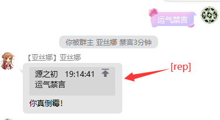
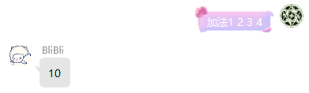
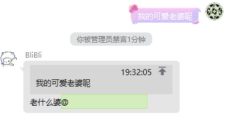

# 智能回复 V1.11
## 优先级以及命令解释-QQ窗口输入
`[J]` 精准回复

`[admins]` 只允许Bot管理回复

`[admin]` 只允许群管理员回复

`[A64]` [A64]......[/A64] 里面包含一个64编码

`[JS]` [JS]......[/JS] 里面包含一个JS代码，不支持导入包，结构简单的小脚本

`[64]` [64]......[/64] 里面包含一个64编码 支持[JS]调用

`[I]` [I]......[/I] 里面包含一个图片的直连 支持[JS]调用

`[A]` [A]......[/A] @面包含一个QQ号码 支持[JS]调用

`[A]` [A] @触发回复的人 支持[JS]调用

`[Vo]` [Vo]......[/Vo] 里面包含一个语音的直连 支持[JS]调用

`[Vi]` [Vi]......[/Vi] 里面包含一个视频的直连 支持[JS]调用

`[W]` [W] 撤回触发的回复 支持[JS]调用

`[S]` [S]......[/S] 里面包含一个禁言几秒秒 支持[JS]调用

`[G]` [G] 开启群禁言 支持[JS]调用

`[g]` [g] 关闭群禁言 支持[JS]调用

`[rep]` [rep] 回复引用触发的人 支持[JS]调用

## 指令
## `关键字[触发词] [J][S]60[/S]`群里有人发[触发词] 就会被禁言60秒
[J]代表精准 比如 [触发词] 等于 禁言， 那么群友发禁言 Bot就会禁言这个发禁言的群友60秒，[J]含义
比如 群友发禁言我 因加了[J]所以该群友不会被禁言，如不加[J] 群友发送 今天被群主禁言了
气死我了，因为里面包含禁言，他就会被禁言60秒，注意:关键字[触发词] [J][S]60[/S]中间
有个空格哦！

## `查看关键` 查看有哪些关键字，可以打 查看关键2 代表查看第二页，默认查看第一页。

## `删除关键[触发词]` 比如[触发词]等于禁言，删除关键禁言。

## `#备份智能回复` 备份配置到指定QQ群 setting.json配置
```json
{
  "group": 495584270,//备份的群
  "gban": [],
  "prefix": {
    "success": "✅",
    "failed": "❎"
  }
}
```

## `#载入配置` 重新载入配置文件

## `#关闭回复` 关闭触发功能

## `#开启回复` 开启触发功能 (默认开启)

## `回复表情[关键字] [手机或PC上传的表情图片，不能只是表情]`注意中间有空格

## 例子
`关键字运气禁言 [J][JS]let VVV=[parameter];let GFT="你运气真好";let sat=["算你运气好！","差点你就被禁言了！","算你运气差！","被禁言了吧哈哈！","你真倒霉！"];let ress=Math.ceil(Math.random()*5);if(ress===1){GFT=sat[0]}else if(ress===2){GFT=sat[1]}else if(ress===3){GFT="[S]60[/S]"+sat[2]}else if(ress===4){GFT="[S]120[/S]"+sat[3]}else if(ress===5){GFT="[S]180[/S]"+sat[4]};"[rep]"+GFT[/JS]`
```js
let VVV = [parameter];//传入的参数 指令加[J]了表示没有参数
let GFT = "你运气真好";
let sat = ["算你运气好！", "差点你就被禁言了！", "算你运气差！", "被禁言了吧哈哈！", "你真倒霉！"];
let ress = Math.ceil(Math.random() * 5);
if (ress === 1) {
    GFT = sat[0]
} else if (ress === 2) {
    GFT = sat[1]
} else if (ress === 3) {
    GFT = "[S]60[/S]" + sat[2]
} else if (ress === 4) {
    GFT = "[S]120[/S]" + sat[3]
} else if (ress === 5) {
    GFT = "[S]180[/S]" + sat[4]
};
"[rep]" + GFT//加了[rep]代表回复触发人，而不是单独发送到群
```



## 例子2

`关键字加法 [JS]let VVV = [parameter]; let jia = 0; for (const He of VVV) { jia += Number(He); } jia[/JS]`
此处无法使用[J]因为需要参数
```js
let VVV = [parameter];//参数类似于 加法1 2 3 4,这个[parameter]会被替换为[1,2,3,4]
let jia = 0;
for (const He of VVV) {
    jia += Number(He);
}
jia
```


## 例子3

`关键字关灯 [J][G]`

`关键字开灯 [J][g]`

`关键字老婆 [rep]老什么婆[S]30[/S][A]`
回复并@了一下并禁言30秒。
